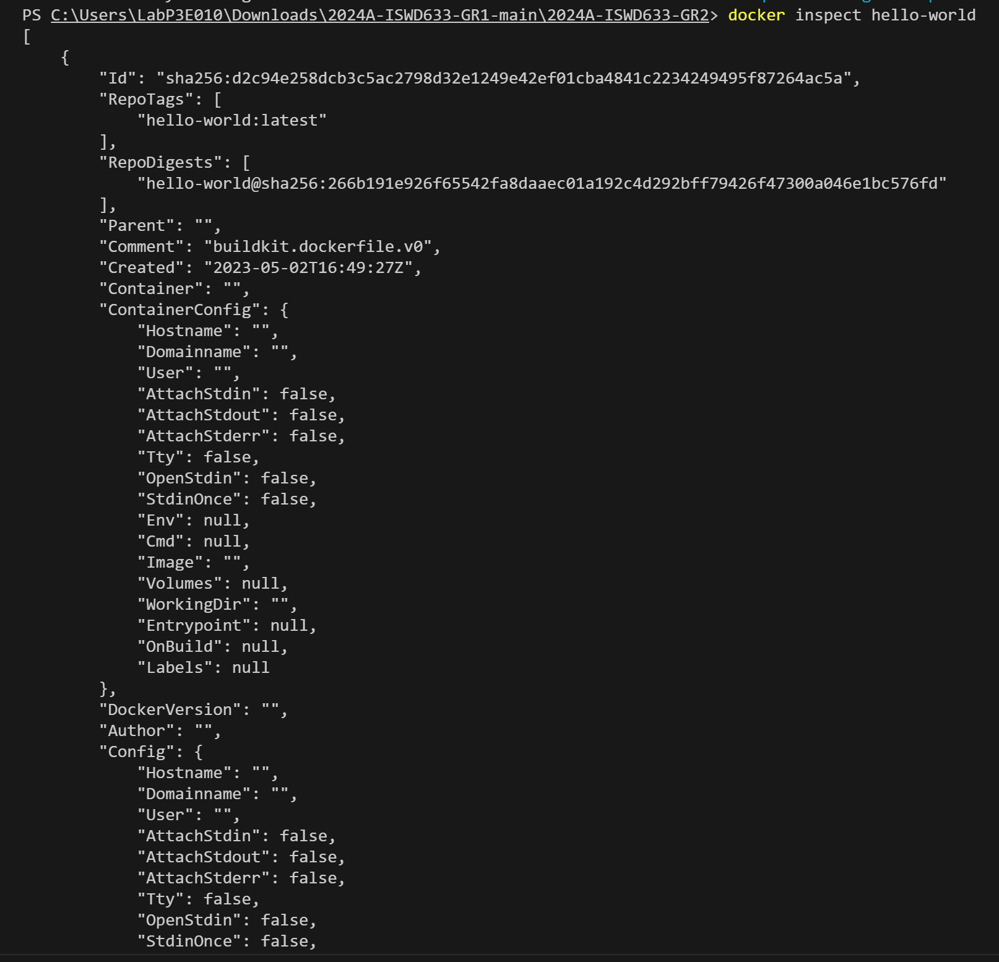
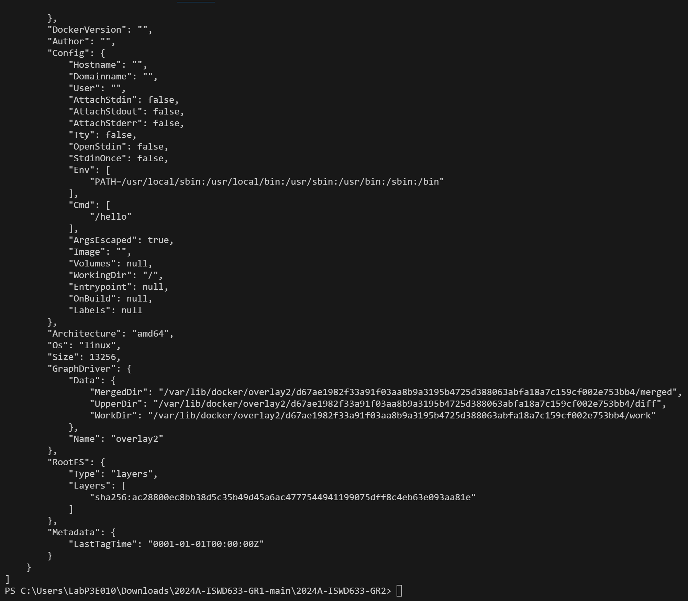

### Indicaciones para la práctica
El contenido solicitado entre paréntesis angulares debe ser reemplazado y los paréntesis angulares deben ser eliminados.

# Imagen
Es un archivo único que contiene todos los programas, librerías, dependencias y configuraciones necesarias para instalar y/o ejecutar una aplicación o un conjunto de aplicaciones.


## ¿Cuál es la relación entre una imagen y un contenedor? 
# COMPLETAR 


## Comandos para imágenes

### Descargar imagen
Descarga la última versión de la imagen disponible en el registro de Docker.

```
docker pull <nombre imagen> 
```

Descarga una versión específica de la imagen, cada imagen tiene etiquetas (tags) para diferentes versiones.
Una imagen puede tener la etiqueta latest para representar la última versión, si no se especifica una etiqueta se hará referencia a la versión latest.

```
docker pull <nombre imagen>:<tag>
```

Descargar la imagen **hello-world**
# COMPLETAR

**¿Qué es nginx**
**NGINX es un software de servidor web de código abierto que se utiliza para proxy inverso, equilibrio de carga y almacenamiento en caché.**
**Proporciona capacidades de servidor HTTPS y está diseñado principalmente para obtener el máximo rendimiento y estabilidad.**
**También funciona como servidor proxy para protocolos de comunicaciones por correo electrónico, como IMAP, POP3 y SMTP.**
# COMPLETAR 

Descargar la imagen  **nginx** en la versión **alpine**
# COMPLETAR

### Listar imágenes

```
docker images
```

# COLOCAR UNA CAPTURA DE PANTALLA DEL RESULTADO 

**Identificadores**
En Docker, se utilizan varios identificadores para diferenciar de manera única los elementos del sistema, como imágenes, contenedores, volúmenes y redes. Estos identificadores son generados automáticamente por Docker y son únicos dentro del contexto del sistema Docker en el que se encuentran. 

### Inspeccionar una imagen
El comando docker inspect se utiliza para obtener información detallada sobre un objeto de Docker específico, como un contenedor, una imagen, un volumen o una red.  Proporciona información en formato JSON sobre el objeto especificado.

```
docker inspect hello-world
```

Inspeccionar la imagen hello-world 


# COMPLETAR

**¿Con qué algoritmo se está generando el ID de la imagen?**
**El ID de la imagen Docker se genera utilizando un algoritmo de hash seguro. En concreto, Docker utiliza el algoritmo de hash SHA-256 para generar el ID único de cada imagen.**
**Este algoritmo es ampliamente utilizado en la industria de la seguridad y se considera seguro y resistente a colisiones.**
**Cada vez que se crea una nueva imagen o se realiza un cambio en una imagen existente, Docker genera un nuevo ID de imagen utilizando este algoritmo.** 
**Esto garantiza la integridad y la unicidad de cada imagen en el sistema Docker.**
# COMPLETAR

### Filtrar imágenes

```
docker images | findstr "hello-world"

```

### Para eliminar una imagen
Eliminar permanentemente la imagen de tu sistema Docker.

```
docker rmi hello-world
```

Eliminar la imagen hello-world 
# COMPLETAR

-f: Es la opción para forzar la eliminación de la imagen incluso si hay contenedores en ejecución que utilizan esa imagen.
Cuando eliminas una imagen Docker, Docker no elimina automáticamente los contenedores que se han creado a partir de esa imagen. Esto significa que, aunque hayas eliminado la imagen, el contenedor seguirá ejecutándose normalmente.  
**Considerar**
Eliminar una imagen no afecta a los contenedores que se han creado a partir de esa imagen, a menos que esos contenedores dependan de archivos o configuraciones específicas de la imagen eliminada. En ese caso, es posible que los contenedores se comporten de manera inesperada después de eliminar la imagen.
Es una buena práctica detener y eliminar todos los contenedores que dependan de una imagen antes de eliminar la imagen en sí.

```
docker rmi -f nginx:alpine
```

